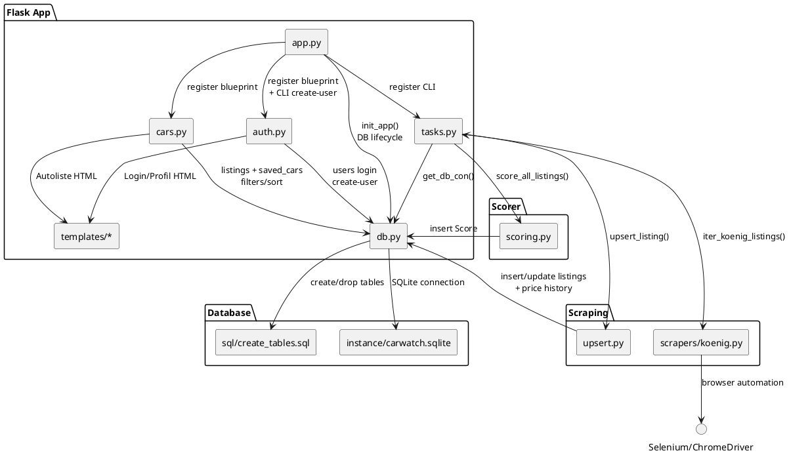

# Architecture

## Überblick

Dieses Diagramm zeigt die Hauptbausteine (Flask App, Scraping, Scorer, Database) und deren Kopplungen.

## Diagramm (empfohlen: als SVG einbetten)

---

## Roh-Quelle (PlantUML)

