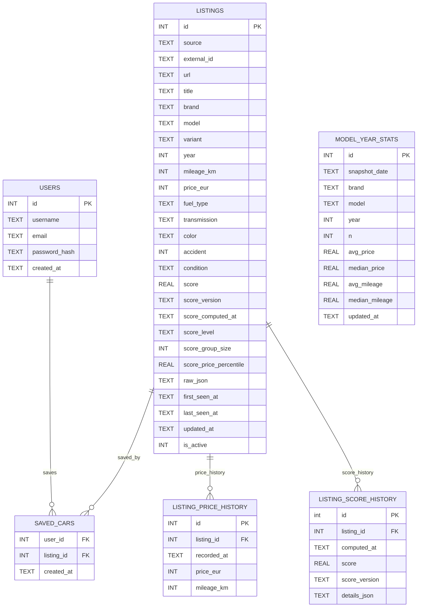

# Data Model

Unten ist das ER-Diagramm als **Mermaid**. Wenn es bei dir nicht rendert, prüfe in `docs/_config.yml`, dass Mermaid aktiviert ist (siehe Datei in diesem Paket).

```mermaid
erDiagram
    USERS ||--o{ SAVED_CARS : saves
    LISTINGS ||--o{ SAVED_CARS : saved_by

    LISTINGS ||--o{ LISTING_PRICE_HISTORY : price_history
    LISTINGS ||--o{ LISTING_SCORE_HISTORY : score_history

    USERS {
        INT id PK
        TEXT username
        TEXT email
        TEXT password_hash
        TEXT created_at
    }

    LISTINGS {
        INT id PK
        TEXT source
        TEXT external_id
        TEXT url
        TEXT title
        TEXT brand
        TEXT model
        TEXT variant
        INT year
        INT mileage_km
        INT price_eur
        TEXT fuel_type
        TEXT transmission
        TEXT color
        INT accident
        TEXT condition
        REAL score
        TEXT score_version
        TEXT score_computed_at
        TEXT score_level
        INT score_group_size
        REAL score_price_percentile
        TEXT raw_json
        TEXT first_seen_at
        TEXT last_seen_at
        TEXT updated_at
        INT is_active
    }

    SAVED_CARS {
        INT user_id FK
        INT listing_id FK
        TEXT created_at
    }

    LISTING_PRICE_HISTORY {
        INT id PK
        INT listing_id FK
        TEXT recorded_at
        INT price_eur
        INT mileage_km
    }

    LISTING_SCORE_HISTORY {
        int id PK
        INT listing_id FK
        TEXT computed_at
        REAL score
        TEXT score_version
        TEXT details_json
    }

    MODEL_YEAR_STATS {
        INT id PK
        TEXT snapshot_date
        TEXT brand
        TEXT model
        INT year
        INT n
        REAL avg_price
        REAL median_price
        REAL avg_mileage
        REAL median_mileage
        TEXT updated_at
    }
```
